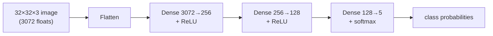

# GTSRB Neural Network from Scratch (NumPy only)

Building traffic-sign classifiers **twice** — once with a deep-learning framework
([US-Traffic-Sign-Classification](https://github.com/AashishH15/US-Traffic-Sign-Classification)),
and once entirely from scratch in **NumPy** to prove the fundamentals. No PyTorch,
no TensorFlow, no autograd: every forward pass, backward pass, and weight update is
hand-written.

This repo is the "from scratch" half. It trains two models on a 5-class subset of
[GTSRB](https://www.kaggle.com/datasets/meowmeowmeowmeowmeow/gtsrb-german-traffic-sign):
a fully-connected MLP and a tiny 2-layer CNN, then compares them.

## What's in here

| File | Purpose |
|------|---------|
| `data.py` | GTSRB 5-class subset loader, 32×32 resize, `[0,1]` normalization, stratified split |
| `model.py` | `MLP`, `TinyCNN`, `Conv2D`, `MaxPool2D`, loss, accuracy, gradient-check helpers |
| `train.py` | Dataset sanity check |
| `compare_models.py` | Trains both models and saves the comparison plots in `results/` |
| `check_mlp.py`, `check_cnn_grad.py`, `check_grad.py` | Numerical gradient checks |

## Architecture

Two models share the same 5-class GTSRB input (32×32×3 RGB images).

### MLP



~820K parameters.

### Tiny CNN


~44K parameters.

Both are trained with mini-batch SGD (cross-entropy loss), optional momentum,
and gradient-norm clipping for stability. The optimizer was verified with a
numerical gradient check (`python check_cnn_grad.py`, `python check_grad.py`).

## Dataset

A 5-class subset of GTSRB training images:

| Class | Sign | Train | Val |
|-------|------|-------|-----|
| 0 | Speed limit 20 | 168 | 42 |
| 1 | Speed limit 30 | 1776 | 444 |
| 14 | Stop | 624 | 156 |
| 33 | Turn right ahead | 551 | 138 |
| 38 | Keep right | 1656 | 414 |

Images are resized to 32×32 RGB and normalized to `[0,1]`. The split is an 80/20
stratified train/validation split.

## How to run

```bash
pip install -r requirements.txt

# First time only: download + extract GTSRB into ./data
python train.py --download

# Train both models and save comparison plots to results/
python compare_models.py --epochs 30
```

Outputs land in `results/`:

- `mlp_training.png` — MLP loss/accuracy curves
- `cnn_training.png` — CNN loss/accuracy curves
- `mlp_vs_cnn.png` — side-by-side validation accuracy

## Results

Validation accuracy on the 5-class subset (best of run, seed 5):

| Model | Params | Val accuracy |
|-------|--------|--------------|
| MLP (80 epochs, lr 0.1) | ~820K | **0.982** |
| Tiny CNN (30 epochs, lr 0.1) | ~44K | **0.998** |
| Majority baseline (always predict "Speed limit 30") | — | 0.372 |

The takeaway: the CNN reaches higher accuracy with **~19× fewer parameters**
and converges in fewer epochs. That gap is the whole reason CNNs dominate image
tasks — local receptive fields and weight sharing matter far more than raw
parameter count for spatial data.

### Comparison with the full classifier

| | This repo (NumPy) | [Full classifier](https://github.com/AashishH15/US-Traffic-Sign-Classification) |
|---|---|---|
| Framework | NumPy only (hand-written backprop) | TensorFlow / Keras |
| Classes | 5 | 43 |
| Architectures | MLP + tiny 2-layer CNN | Deeper LeNet-style CNN |
| Best val accuracy | ~0.998 (CNN, 5 classes) | Higher (more classes, more data, augmentation) |
| Goal | Understand the math end-to-end | Production-style pipeline |

The full classifier uses a deeper CNN with data augmentation on all 43 GTSRB
classes — a stronger model, but its internals are hidden behind a framework. This
repo is the complement: the same kind of problem solved with nothing but NumPy,
so every line of the gradient is visible.

## Demo

A short screen recording of a training run lives at `docs/training-demo.mp4`
(recorded with the Windows Snipping Tool). It shows the loss/accuracy curves
dropping live for the CNN.

## Learning sources

- [Neural Networks: Zero to Hero](https://www.youtube.com/playlist?list=PLAqhIrjkxbuWI23v9cThsA9GvCAUhRvKZ) — backprop, softmax, training loops
- [Victor Zhou — Intro to CNNs](https://victorzhou.com/blog/intro-to-cnns-part-1/) — conv, pooling, im2col intuition

## License

MIT.
